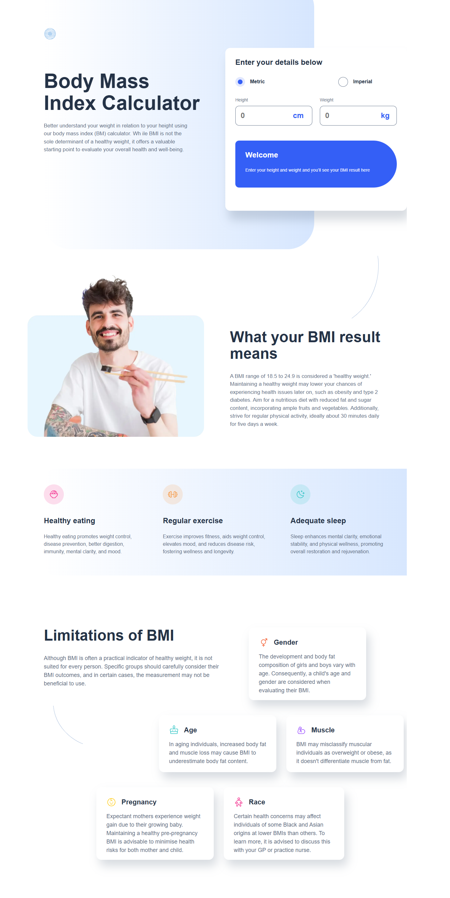

# 🧮 Bmi Calculator
Esta es una solución al [desafío Body Mass Index Calculator en Frontend Mentor](https://www.frontendmentor.io/challenges/body-mass-index-calculator-brrBkfSz1T). Los desafíos de Frontend Mentor ayudan a mejorar tus habilidades de programación creando proyectos realistas.

## 🔎 Descripción general
Diseño responsive para resolución mobile(375px), tablet(768px) y desktop(1440px)

### 📷 Captura de pantalla

### 🔗 Links
- [Repositorio Git](https://github.com/braismarquez2025/BMI-Calculator)
- [URL del sitio en vivo]()

## 🚀 Mi proceso

### 🔧 Llevado a cabo con
- React + Vite
- Sass

### 💡 Lo que aprendí
Con este proyecto me estreno usando React y me ha encantado, me queda mucho por aprender pero la rapidez a la hora de programar es increíble, además de la organización que puedes tener con los distintos componentes. 
En cuanto a los estilos me ha dado la lata el componente de la calculadora cuando el usuario escoge el modo imperial, ya que todos los elementos que tenía posicionados de forma absoluta se me descolocaban. Como puedo solucionar este problema para futuras ocasiones, que un elemento crezca al cambiar su estado y el resto de la pagina crezca con él? A pesar de todo creo que me ha quedado bastante bien, pero mejorable sin duda.

### 📈 Desarrollo continuo
Me voy a especializar con React hasta conseguir un codigo lo mejor estructurado posible, evitando codigo que no sea reutilizable o repetido. 

### ✌️ Autor 
- 💼 GitHub - https://github.com/braismarquez2025
- ✉️ Gmail - braismarquez2003@gmail.com
- 👤 Usuario de Frontend - [@braismarquez2025](https://www.frontendmentor.io/profile/braismarquez2025)
- 🔗 LinkedIn - [Brais Márquez](https://www.linkedin.com/in/brais-m%C3%A1rquez-b133b7365/)